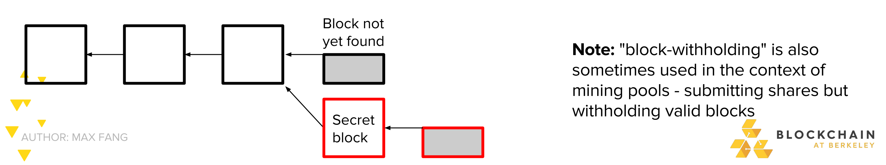
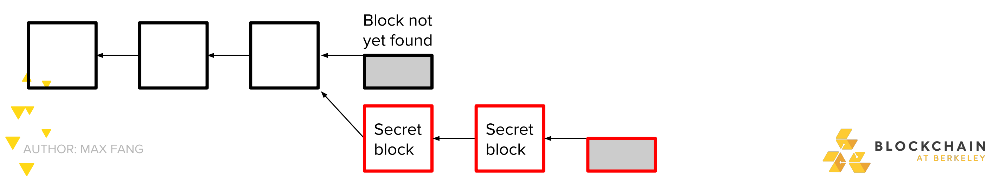
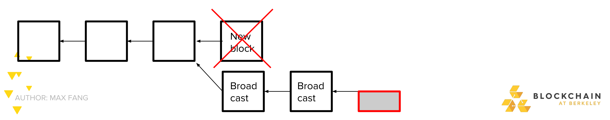
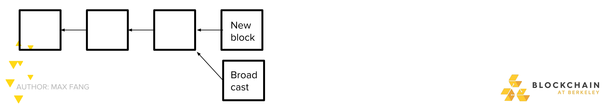

#DEFINITION of '51% Attack'
51% attack refers to an attack on a blockchain – usually bitcoin's, for which such an attack is still hypothetical – by a group of miners controlling more than 50% of the network's mining hashrate, or computing power. The attackers would be able to prevent new transactions from gaining confirmations, allowing them to halt payments between some or all users. They would also be able to reverse transactions that were completed while they were in control of the network, meaning they could double-spend coins.

BREAKING DOWN '51% Attack'
Bitcoin and other cryptocurrencies are based on blockchains, a form of distributed ledger. These digital files record every transaction made on a cryptocurrency's network and are available to all users – and the general public – for review, meaning that no one can spend a coin twice. (So-called "private blockchains" introduce permissions to prevent certain users of the general public from seeing all the data on a blockchain.)

As its name implies, a blockchain is a chain of blocks, bundles of data that record all completed transactions during a given period of time (for bitcoin, a new block is generated approximately every10 minutes). Once a block is finalized – "mined," in the jargon – it cannot be altered, since a fraudulent version of the public ledger would quickly be spotted and rejected by the network's users. 

However, by controlling the majority of the computing power on the network, an attacker or group of attackers can interfere with the process of recording new blocks. They can prevent other miners from completing blocks, theoretically allowing them to monopolize the mining of new blocks and earn all of the rewards (for bitcoin, the reward is currently 12.5 newly-created bitcoins, though it will  eventually drop to zero). They can block other users' transactions. They can send a transaction, then reverse it, making it appear as though they still had the coin they just spent. This vulnerability, known as double-spending, is the digital equivalent of a perfect counterfeit and the basic cryptographic hurdle the blockchain was built to overcome, so a network that allowed for double-spending would quickly suffer a loss of confidence.

Changing historical blocks, transactions locked in prior to the start of the attack, would be extremely difficult even in the event of a 51% attack. The further back the transactions are, the more difficult it would be to change them. It would be impossible to change transactions prior to a checkpoint, past which transactions are hard-coded into bitcoin's software.

On the other hand, a form of a 51% attack is possible with less than 50% of the network's mining power, but with a lower probability of success.

You are a miner, suppose you have just found the blokc.
 -Instead of accouncing block to the network and receiving reward, keep it secret
 - Try to find two blocks in a row before the networks finds the next one

This is called selfish mining or block-witholding

Note:  "block-witholding" is also sometimes used
	in the context of mining pools -submitting
	shares but witholding valid blocks

If you succeeded in finding a second block, you have prevailed
 - Network still believes it is mining on the longest prof of work chain
 -You continouse to mine on your own chain

If the network find a block, you broadcast your two secret block and make the network invalid
- While network was working on the invalid block, you got a bunch of time to mine by yourself... for free!
-Free time mining on network
 => higher effercive proportion of hashrate => higher expected profits!
 
 
 
 But what of the network found their new block before you could find a second one? Race to propagate!

- If on average you manage to tell 50% of the network about you block first:
- Malicious strategy is more profitable if you have >~25% mining power
_ If you have >~33% mining power, ***you can lose the race every time and malicious strategy is still more profitable!***
- (actual math omitted due to complexity)

 

Ghash.io
The mining pool ghash.io briefly exceeding 50% of the bitcoin network's computing power in July 2014, leading the pool to voluntarily commit to reducing its share of the network. It said in a statement that it would not reach 40% of the total mining power in the future.

Krypton and Shift
Krypton and Shift, two blockchains based on ethereum, suffered 51% attacks in August 2016.

#34% Attack
The tangle, a distributed ledger that is fundamentally distinct from a blockchain but designed to accomplish similar goals, could theoretically succumb to an attacker deploying over a third of the network's hashrate, referred to as a 34% attack.

-Selfish Mining
-Stubborn Mining Model
-Selfish Mining Defense
-Game-Theory Based Censorship
-51% Attacks and Collusions
Reference:
https://cyber.stanford.edu/sites/default/files/20180124_bpase_game_theoretical_attacks_on_bitcoin.pdf

- Incentivizing Double-Spend Collusion in Bitcoin   https://www.cs.umd.edu/~gasarch/reupapers/katzbitcoin16.pdf
- Smart Contracts for Bribing Miners http://homepages.cs.ncl.ac.uk/patrick.mccorry/minerbribery.pdf
- Incentivizing Blockchain Forks via Whale Transactions https://www.cs.umd.edu/~jkatz/papers/whale-txs.pdf
- Antbleed https://www.coindesk.com/antbleed-bitcoins-newest-new-controversy-explained/
- https://www.researchgate.net/publication/307507694_Why_Buy_When_You_Can_Rent
- On the Instability of Bitcoin Without the Block Reward  http://randomwalker.info/publications/mining_CCS.pdf
- FruitChains: A Fair Blockchain  - https://dl.acm.org/citation.cfm?id=3087809
- Eclipse attack vs. Sybil attack  https://bitcoin.stackexchange.com/questions/61151/eclipse-attack-vs-sybil-attack
- Eclipse Attacks on Bitcoin’s Peer-to-Peer Network  https://eprint.iacr.org/2015/263.pdf

Reference:
https://www.investopedia.com/terms/1/51-attack.asp#ixzz5HVYLPkf3 
